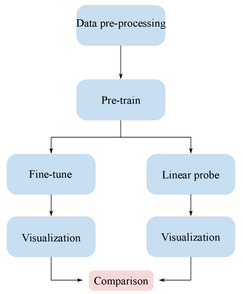
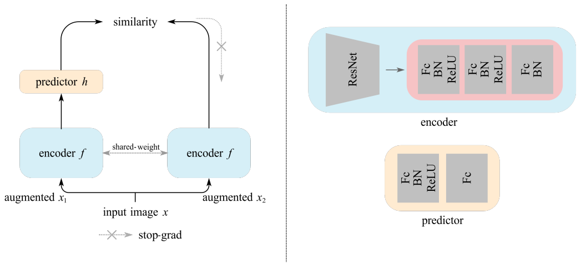

# Prediction of Severity and TImely Intervention Strategies for Sleep Apnea Based on Fundus Camera Vascular Images

## Introduction
This repository is programming of my graduiated theis whose title is **"Prediction of Sleep Apnea and Timely Intervention Strategies Based on Fundus Vascular Images"**. The chinese title is **基於眼底鏡血管影像的睡眠呼吸中止症預測及適時干擾策略**

Our dataset come from Tungs' Taichung MetroHarbor Hospital (台中市立童綜合醫院) and had passed IRB after remove personal informations of patients. These dataset have 80k images but only 20k images have label. After processing, we got 10k images approximately. 164 images were labeled OSA (called **positive**) and others were labeled normal (called **negative**).

## Architecture

Since these dataset have a lot of negatives, we use contrastive learning to perform pre-training. In this study, we refer to **SimSiam**[1] and revised it slightly, their official code can available on [Here](https://github.com/facebookresearch/simsiam). Additionally, we use another framework called **Masked Autoencoder**[2] and compare with our method. However, this approach must have a large amount of dataset (up to million-level), so we take another pre-training representations called **RETFound**[3] and add our dataset to fine-tune these weights. The official code and pre-training representations can be accessed by [Here](https://github.com/rmaphoh/RETFound_MAE). It will teach you how to install environment and use it carefully.

In this study, we also use focal loss to address class imbalanced problem. The implement of focal loss can be downloaded from [Here](https://github.com/mathiaszinnen/focal_loss_torch). It will teach you how to install it.

## Reference
[1] [Exploring Simple Siamese Representaion Learning (2021 CVPR)](https://arxiv.org/abs/2011.10566)

[2] [Masked Autoencoders Are Scalable Vision Learners (2022 CVPR)](https://arxiv.org/abs/2111.06377)

[3] [A foundation model for generalizable disease detection from retinal images (2023 NATURE)](https://www.nature.com/articles/s41586-023-06555-x)